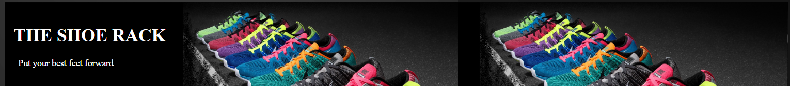
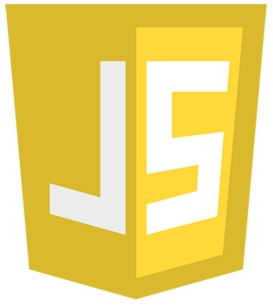
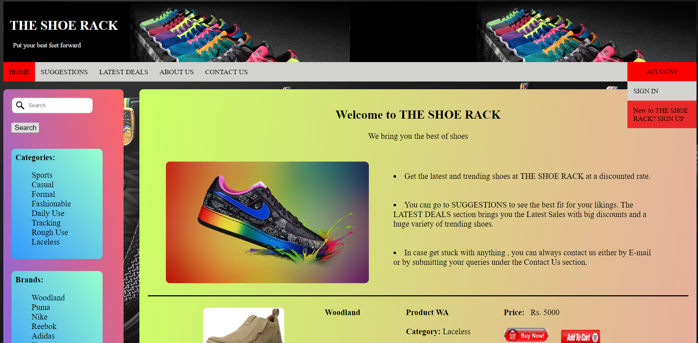
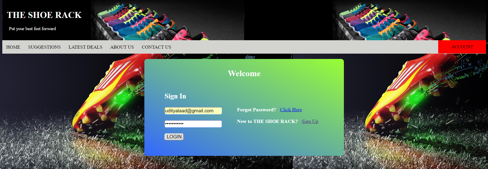
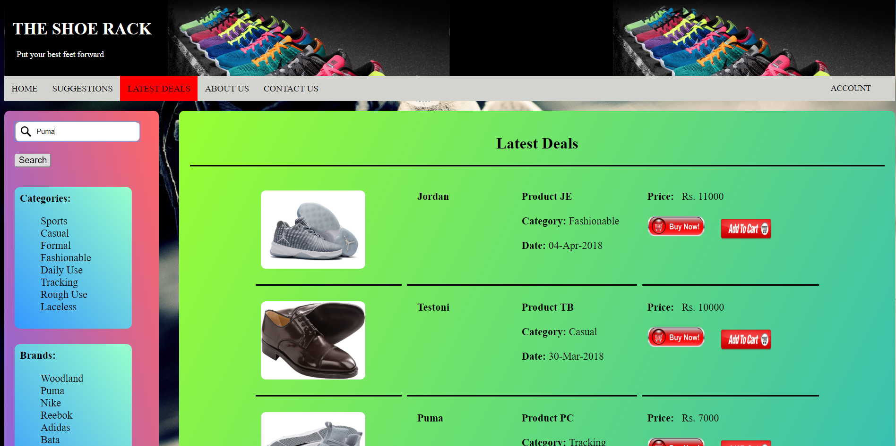
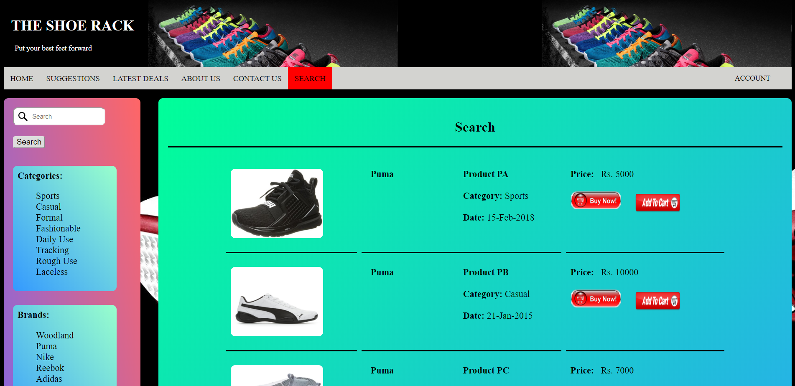
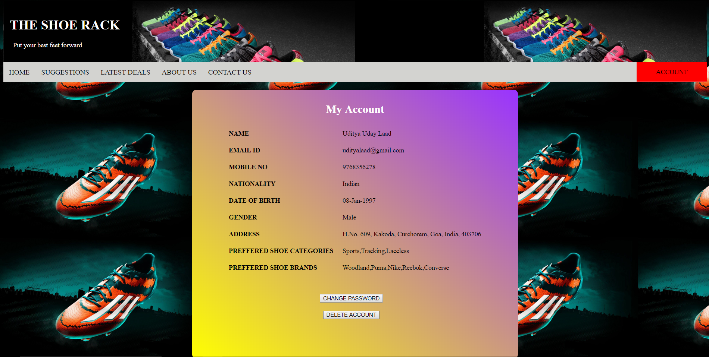

<!-- Reference:
https://github.com/othneildrew/Best-README-Template -->

<!-- PROJECT LOGO -->
 

  <h1><i> The Shoe Rack </i></h1>

  
  .

  

    An Intelligent Analyzer & Suggestions Builder, cum E-Commerce Platform !
  

 

<!-- TABLE OF CONTENTS -->

  
Table of Contents

  <ol>
    <li><a href="#about-the-project">About The Project</a></li>
    <li><a href="#built-with">Built With</a></li>
    <li><a href="#getting-started">Getting Started</a></li>
    <li><a href="#some-screenshots">Some Screenshots</a></li>
    <li><a href="#license-or-author">License or Author</a></li>
    <li><a href="#contact">Contact</a></li>
    <li><a href="#acknowledgments">Acknowledgments</a></li>
  </ol>

 

<!-- ABOUT THE PROJECT -->
## About The Project
  * Developed and implemented coherent algorithms to perform efficient cost and feature analysis, in order to generate dynamic comparison of products.
  * Created a Web App. - to display best-to-worst results, and also act as an E-Commerce portal (for shoes).

  
(<a href="#readme-top">back to top</a>)

## Built With
  &nbsp; &nbsp; &nbsp;  &nbsp; &nbsp; &nbsp; &nbsp; &nbsp; &nbsp;  &nbsp; &nbsp; &nbsp; &nbsp; &nbsp; &nbsp;  &nbsp; &nbsp; &nbsp; &nbsp; &nbsp; &nbsp;  &nbsp; &nbsp; &nbsp; &nbsp; &nbsp; &nbsp;  &nbsp; &nbsp; &nbsp; &nbsp; &nbsp; 

  &nbsp; &nbsp; &nbsp; &nbsp; &nbsp; &nbsp; &nbsp; &nbsp; <b><i> JSP </i></b> &nbsp; &nbsp; &nbsp; &nbsp; &nbsp; &nbsp; &nbsp; &nbsp; &nbsp; &nbsp; <b><i> HTML </i></b> &nbsp; &nbsp; &nbsp; &nbsp; &nbsp; &nbsp; &nbsp; &nbsp; &nbsp; &nbsp; <b><i> CSS </i></b> &nbsp; &nbsp; &nbsp; &nbsp; &nbsp; &nbsp; &nbsp; &nbsp; &nbsp; <b><i> JavaScript </i></b> &nbsp; &nbsp; &nbsp; &nbsp; &nbsp; &nbsp; &nbsp; <b><i> Oracle DB </i></b> &nbsp; &nbsp; &nbsp; &nbsp; &nbsp; <b><i> Apache Tomcat </i></b>

  
(<a href="#readme-top">back to top</a>)

<!-- GETTING STARTED -->
## Getting Started
  #### Prerequisites
  * JSP, HTML, CSS, JavaScript
  * Oracle Database 10g XE (SQL), Apache Tomcat Server 9
  * IDE - VS Code (Preferred)
  * Machine Requirements: Minimum 4GB RAM, Intel i5 Processor (or Equivalent)
  
  #### Setup and Use
  1. ###### Set Up Database 
       1. Download and set-up Oracle 10g XE.
       2. Set-up the Database.
       3. Create the required tables and add the required data, using queries provided in <b>'/Main Project/Oracle Database/THE SHOE RACK.txt'</b>
       4. Copy DB Credentials

  2. ###### Set Up Application
       1. Get the source code from <b>'/Main Project/Web App - Using JSP/THE SHOE RACK/'</b>
       2. Update each and every <b>'.jsp'</b> file with the new DB credentials (Set-up in Step-1).

   3. ###### Run Application
       1. Download, install and set-up <b>Tomcat Server</b>.
       2. Copy the application source (set-up in Step-2) to Tomcat's root directory.
       3. Start Tomcat Server
       4. Run HOME.jsp over Tomcat Server.

  
(<a href="#readme-top">back to top</a>)

<!-- SOME SCREENSHOTS -->
## Some Screenshots
   

    
       
    
       
    
       
    
       
    
  

   
   
(<a href="#readme-top">back to top</a>)

   
<!-- LICENSE -->
## License or Author
  * Uditya Laad, Goa College of Engineering, Goa University, GA, IN

  
(<a href="#readme-top">back to top</a>)

<!-- CONTACT -->
## Contact
  <b>Uditya Laad</b> &nbsp; [@linkedin.com/in/uditya-laad-222680148](https://www.linkedin.com/in/uditya-laad-222680148/)
  
  &nbsp; &nbsp; &nbsp; &nbsp; &nbsp; &nbsp; &nbsp; &nbsp; &nbsp; &nbsp; &nbsp; [@github.com/udityalaad](https://github.com/udityalaad)
  
  &nbsp; &nbsp; &nbsp; &nbsp; &nbsp; &nbsp; &nbsp; &nbsp; &nbsp; &nbsp; &nbsp; udityalaad123@gmail.com

  <b>Project Link</b> &nbsp; [https://github.com/udityalaad/The_Shoe_Rack](https://github.com/udityalaad/The_Shoe_Rack)

  
(<a href="#readme-top">back to top</a>)

<!-- ACKNOWLEDGMENTS -->
## Acknowledgments
  * [github.com/othneildrew/Best-README-Template/](https://github.com/othneildrew/Best-README-Template)
  * Google Images
  
  
(<a href="#readme-top">back to top</a>)

